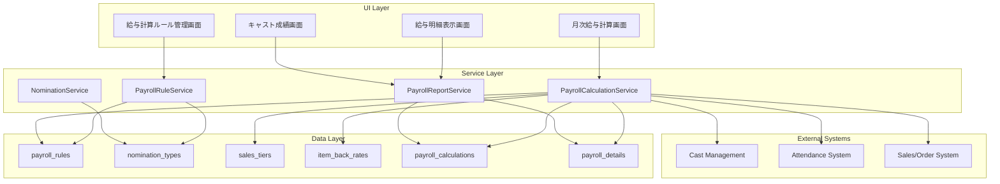

# Design Document

## Overview

キャバクラ業界特有の複雑な給与計算システムを設計します。現在のシステムは単純な時給と一律のバック率による計算ですが、実際の業務では100パターン近くある複雑なバック率、指名種別による計算の違い、売上スライド制など、非常に複雑な給与体系に対応する必要があります。

このシステムは、既存のキャスト管理、勤怠管理、売上管理システムと連携し、正確で効率的な給与計算を実現します。

## Architecture

### System Components



### Database Schema Design

#### 新規テーブル設計

**payroll_rules (給与計算ルール)**
```sql
CREATE TABLE payroll_rules (
    id UUID PRIMARY KEY DEFAULT gen_random_uuid(),
    rule_name VARCHAR(100) NOT NULL,
    description TEXT,
    base_hourly_rate INTEGER NOT NULL DEFAULT 0,
    base_back_percentage DECIMAL(5,2) NOT NULL DEFAULT 0,
    is_active BOOLEAN NOT NULL DEFAULT true,
    effective_from DATE NOT NULL,
    effective_until DATE,
    created_by UUID REFERENCES staffs(id),
    created_at TIMESTAMPTZ NOT NULL DEFAULT now(),
    updated_at TIMESTAMPTZ NOT NULL DEFAULT now()
);
```

**nomination_types (指名種別)**
```sql
CREATE TABLE nomination_types (
    id UUID PRIMARY KEY DEFAULT gen_random_uuid(),
    type_name VARCHAR(50) NOT NULL UNIQUE,
    display_name VARCHAR(100) NOT NULL,
    back_percentage DECIMAL(5,2) NOT NULL,
    priority_order INTEGER NOT NULL DEFAULT 0,
    is_active BOOLEAN NOT NULL DEFAULT true,
    created_at TIMESTAMPTZ NOT NULL DEFAULT now()
);
```

**sales_tiers (売上スライド)**
```sql
CREATE TABLE sales_tiers (
    id UUID PRIMARY KEY DEFAULT gen_random_uuid(),
    payroll_rule_id UUID NOT NULL REFERENCES payroll_rules(id) ON DELETE CASCADE,
    tier_name VARCHAR(50) NOT NULL,
    min_sales_amount INTEGER NOT NULL,
    max_sales_amount INTEGER,
    back_percentage DECIMAL(5,2) NOT NULL,
    bonus_amount INTEGER DEFAULT 0,
    created_at TIMESTAMPTZ NOT NULL DEFAULT now()
);
```

**item_back_rates (項目別バック率)**
```sql
CREATE TABLE item_back_rates (
    id UUID PRIMARY KEY DEFAULT gen_random_uuid(),
    payroll_rule_id UUID NOT NULL REFERENCES payroll_rules(id) ON DELETE CASCADE,
    item_category VARCHAR(50) NOT NULL,
    back_percentage DECIMAL(5,2) NOT NULL,
    min_guarantee_amount INTEGER DEFAULT 0,
    max_limit_amount INTEGER,
    created_at TIMESTAMPTZ NOT NULL DEFAULT now()
);
```

**cast_payroll_assignments (キャスト給与ルール割り当て)**
```sql
CREATE TABLE cast_payroll_assignments (
    id UUID PRIMARY KEY DEFAULT gen_random_uuid(),
    cast_id UUID NOT NULL REFERENCES casts_profile(id) ON DELETE CASCADE,
    payroll_rule_id UUID NOT NULL REFERENCES payroll_rules(id) ON DELETE CASCADE,
    assigned_from DATE NOT NULL,
    assigned_until DATE,
    is_active BOOLEAN NOT NULL DEFAULT true,
    assigned_by UUID REFERENCES staffs(id),
    created_at TIMESTAMPTZ NOT NULL DEFAULT now(),
    UNIQUE(cast_id, assigned_from)
);
```

**payroll_calculations (給与計算結果)**
```sql
CREATE TABLE payroll_calculations (
    id UUID PRIMARY KEY DEFAULT gen_random_uuid(),
    cast_id UUID NOT NULL REFERENCES casts_profile(id),
    calculation_period_start DATE NOT NULL,
    calculation_period_end DATE NOT NULL,
    payroll_rule_id UUID NOT NULL REFERENCES payroll_rules(id),
    base_salary INTEGER NOT NULL DEFAULT 0,
    total_back_amount INTEGER NOT NULL DEFAULT 0,
    total_bonus_amount INTEGER NOT NULL DEFAULT 0,
    total_deductions INTEGER NOT NULL DEFAULT 0,
    gross_amount INTEGER NOT NULL DEFAULT 0,
    net_amount INTEGER NOT NULL DEFAULT 0,
    calculation_status VARCHAR(20) NOT NULL DEFAULT 'draft',
    calculated_by UUID REFERENCES staffs(id),
    approved_by UUID REFERENCES staffs(id),
    approved_at TIMESTAMPTZ,
    created_at TIMESTAMPTZ NOT NULL DEFAULT now(),
    updated_at TIMESTAMPTZ NOT NULL DEFAULT now(),
    UNIQUE(cast_id, calculation_period_start, calculation_period_end)
);
```

**payroll_details (給与計算詳細)**
```sql
CREATE TABLE payroll_details (
    id UUID PRIMARY KEY DEFAULT gen_random_uuid(),
    payroll_calculation_id UUID NOT NULL REFERENCES payroll_calculations(id) ON DELETE CASCADE,
    detail_type VARCHAR(50) NOT NULL,
    item_name VARCHAR(100) NOT NULL,
    base_amount INTEGER NOT NULL DEFAULT 0,
    rate_percentage DECIMAL(5,2),
    calculated_amount INTEGER NOT NULL DEFAULT 0,
    source_data JSONB,
    created_at TIMESTAMPTZ NOT NULL DEFAULT now()
);
```

#### 既存テーブルの拡張

**order_items テーブルに指名種別を追加**
```sql
ALTER TABLE order_items 
ADD COLUMN nomination_type_id UUID REFERENCES nomination_types(id),
ADD COLUMN nomination_fee INTEGER DEFAULT 0;
```

## Components and Interfaces

### Service Layer Components

#### PayrollRuleService
給与計算ルールの管理を担当するサービス

**主要メソッド:**
- `createPayrollRule(ruleData: PayrollRuleInput): Promise<PayrollRule>`
- `updatePayrollRule(id: string, ruleData: Partial<PayrollRuleInput>): Promise<PayrollRule>`
- `getPayrollRules(filters?: PayrollRuleFilters): Promise<PayrollRule[]>`
- `assignRuleTocast(castId: string, ruleId: string, effectiveFrom: Date): Promise<void>`
- `validateRuleConsistency(ruleData: PayrollRuleInput): Promise<ValidationResult>`

#### PayrollCalculationService
給与計算の実行を担当するサービス

**主要メソッド:**
- `calculateMonthlyPayroll(castId: string, year: number, month: number): Promise<PayrollCalculation>`
- `calculateBulkPayroll(castIds: string[], year: number, month: number): Promise<PayrollCalculation[]>`
- `recalculatePayroll(calculationId: string): Promise<PayrollCalculation>`
- `approvePayrollCalculation(calculationId: string, approvedBy: string): Promise<void>`

**計算ロジック:**
1. 基本給計算（時給 × 勤務時間）
2. 売上スライド適用
3. 指名種別別バック計算
4. 項目別バック計算
5. ボーナス・控除適用
6. 最終金額確定

#### NominationService
指名種別の管理を担当するサービス

**主要メソッド:**
- `createNominationType(typeData: NominationTypeInput): Promise<NominationType>`
- `updateNominationType(id: string, typeData: Partial<NominationTypeInput>): Promise<NominationType>`
- `getNominationTypes(): Promise<NominationType[]>`
- `recordNomination(orderId: number, nominationTypeId: string, castId: string): Promise<void>`

#### PayrollReportService
給与レポートの生成を担当するサービス

**主要メソッド:**
- `generatePayrollSummary(year: number, month: number): Promise<PayrollSummary>`
- `generateCastPayrollDetail(castId: string, calculationId: string): Promise<PayrollDetail>`
- `generatePayrollComparison(castId: string, periods: DateRange[]): Promise<PayrollComparison>`
- `exportPayrollData(filters: PayrollExportFilters): Promise<ExportResult>`

### UI Components

#### PayrollRuleManagement
給与計算ルールの設定・管理画面

**機能:**
- ルール一覧表示
- 新規ルール作成フォーム
- ルール編集・削除
- キャストへのルール割り当て
- ルール有効性検証

#### MonthlyPayrollCalculation
月次給与計算の実行画面

**機能:**
- 計算対象期間選択
- 対象キャスト選択
- 一括計算実行
- 計算結果プレビュー
- 異常値検出・警告表示
- 計算結果承認

#### PayrollDetailView
給与明細の表示画面

**機能:**
- 給与明細詳細表示
- 計算根拠の表示
- 過去履歴の参照
- PDF出力機能

#### CastPerformanceDashboard
キャスト個人の成績表示画面

**機能:**
- 当月売上・給与見込み表示
- 日別・週別推移グラフ
- 目標達成状況表示
- 次段階までの必要売上表示

## Data Models

### Core Types

```typescript
interface PayrollRule {
  id: string;
  ruleName: string;
  description?: string;
  baseHourlyRate: number;
  baseBackPercentage: number;
  salesTiers: SalesTier[];
  itemBackRates: ItemBackRate[];
  isActive: boolean;
  effectiveFrom: Date;
  effectiveUntil?: Date;
}

interface SalesTier {
  id: string;
  tierName: string;
  minSalesAmount: number;
  maxSalesAmount?: number;
  backPercentage: number;
  bonusAmount?: number;
}

interface NominationType {
  id: string;
  typeName: string;
  displayName: string;
  backPercentage: number;
  priorityOrder: number;
  isActive: boolean;
}

interface PayrollCalculation {
  id: string;
  castId: string;
  cast: Cast;
  calculationPeriodStart: Date;
  calculationPeriodEnd: Date;
  payrollRule: PayrollRule;
  baseSalary: number;
  totalBackAmount: number;
  totalBonusAmount: number;
  totalDeductions: number;
  grossAmount: number;
  netAmount: number;
  details: PayrollDetail[];
  calculationStatus: 'draft' | 'calculated' | 'approved' | 'paid';
}

interface PayrollDetail {
  id: string;
  detailType: string;
  itemName: string;
  baseAmount: number;
  ratePercentage?: number;
  calculatedAmount: number;
  sourceData?: any;
}
```

## Error Handling

### Validation Rules

1. **ルール整合性チェック**
   - 売上スライドの重複・欠落検証
   - バック率の合理性チェック（0-100%範囲）
   - 有効期間の重複チェック

2. **計算データ検証**
   - 売上データの存在確認
   - 勤怠データの整合性確認
   - 指名データの妥当性確認

3. **異常値検出**
   - 前月比大幅変動の検出
   - 異常に高い/低い給与額の検出
   - 計算エラーの検出

### Error Recovery

- 計算エラー時の自動再試行
- 部分的な計算失敗時の継続処理
- データ不整合時の警告表示
- 手動修正機能の提供

## Testing Strategy

### Unit Tests

1. **PayrollCalculationService**
   - 各種計算ロジックのテスト
   - 境界値テスト（売上スライド境界等）
   - エラーケースのテスト

2. **PayrollRuleService**
   - ルール作成・更新のテスト
   - バリデーションロジックのテスト
   - キャスト割り当てのテスト

3. **NominationService**
   - 指名種別管理のテスト
   - 指名記録のテスト

### Integration Tests

1. **給与計算フロー**
   - 売上データ取得から給与計算完了まで
   - 複数キャストの一括計算
   - 計算結果の承認フロー

2. **データ整合性**
   - 既存システムとの連携テスト
   - データ移行テスト
   - 並行処理テスト

### Performance Tests

1. **大量データ処理**
   - 100名以上のキャスト一括計算
   - 1年分の履歴データ処理
   - レポート生成パフォーマンス

2. **同時実行**
   - 複数ユーザーによる同時計算実行
   - データ競合状態のテスト

## Security Considerations

### Access Control

- 給与データへのアクセス制限（経理・管理者のみ）
- キャスト個人データの閲覧制限
- 計算ルール変更の権限管理

### Data Protection

- 給与データの暗号化
- 計算履歴の改ざん防止
- 個人情報の匿名化オプション

### Audit Trail

- 全ての給与計算の実行ログ
- ルール変更の履歴記録
- 承認・修正の追跡

## Performance Optimization

### Database Optimization

- 給与計算用のインデックス最適化
- 大量データ処理用のパーティショニング
- 計算結果のキャッシュ戦略

### Calculation Optimization

- バッチ処理による効率化
- 並列計算の実装
- 増分計算の活用

### UI Performance

- 大量データ表示の仮想化
- 計算進捗の表示
- 非同期処理によるUX向上