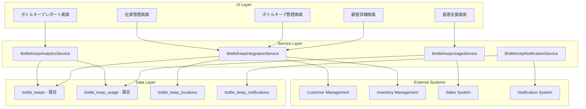

# Design Document

## Overview

ボトルキープ統合機能は、既存のボトルキープシステムを顧客管理システムと密接に統合し、顧客詳細画面での一覧表示、接客中の迅速な確認、効率的な在庫管理を実現します。この統合により、顧客満足度の向上と売上最大化を図ります。

## Architecture

### System Components



### Database Schema Design

#### 新規テーブル設計

**bottle_keep_locations (ボトル保管場所)**

```sql
CREATE TABLE bottle_keep_locations (
    id UUID PRIMARY KEY DEFAULT gen_random_uuid(),
    location_code VARCHAR(20) NOT NULL UNIQUE,
    location_name VARCHAR(100) NOT NULL,
    description TEXT,
    capacity INTEGER NOT NULL DEFAULT 50,
    current_count INTEGER NOT NULL DEFAULT 0,
    is_active BOOLEAN NOT NULL DEFAULT true,
    created_at TIMESTAMPTZ NOT NULL DEFAULT now(),
    updated_at TIMESTAMPTZ NOT NULL DEFAULT now()
);
```

**bottle_keep_notifications (ボトルキープ通知)**

```sql
CREATE TABLE bottle_keep_notifications (
    id UUID PRIMARY KEY DEFAULT gen_random_uuid(),
    bottle_keep_id UUID NOT NULL REFERENCES bottle_keeps(id) ON DELETE CASCADE,
    notification_type VARCHAR(50) NOT NULL, -- 'expiry_warning', 'low_remaining', 'consumed'
    notification_date DATE NOT NULL,
    is_sent BOOLEAN NOT NULL DEFAULT false,
    sent_at TIMESTAMPTZ,
    recipient_type VARCHAR(20) NOT NULL, -- 'customer', 'staff', 'system'
    recipient_id UUID,
    message TEXT,
    created_at TIMESTAMPTZ NOT NULL DEFAULT now()
);
```

**bottle_keep_movement_logs (ボトル移動履歴)**

```sql
CREATE TABLE bottle_keep_movement_logs (
    id UUID PRIMARY KEY DEFAULT gen_random_uuid(),
    bottle_keep_id UUID NOT NULL REFERENCES bottle_keeps(id) ON DELETE CASCADE,
    from_location_id UUID REFERENCES bottle_keep_locations(id),
    to_location_id UUID REFERENCES bottle_keep_locations(id),
    movement_type VARCHAR(20) NOT NULL, -- 'store', 'retrieve', 'relocate'
    moved_by UUID REFERENCES staffs(id),
    movement_reason TEXT,
    moved_at TIMESTAMPTZ NOT NULL DEFAULT now()
);
```

#### 既存テーブルの拡張

**bottle_keeps テーブルの拡張**

```sql
ALTER TABLE bottle_keeps
ADD COLUMN location_id UUID REFERENCES bottle_keep_locations(id),
ADD COLUMN priority_order INTEGER DEFAULT 0,
ADD COLUMN last_used_date DATE,
ADD COLUMN usage_frequency INTEGER DEFAULT 0,
ADD COLUMN estimated_consumption_days INTEGER,
ADD COLUMN is_favorite BOOLEAN DEFAULT false,
ADD COLUMN purchase_price INTEGER,
ADD COLUMN deposit_amount INTEGER;
```

**bottle_keep_usage テーブルの拡張**

```sql
ALTER TABLE bottle_keep_usage
ADD COLUMN usage_type VARCHAR(20) DEFAULT 'consumption', -- 'consumption', 'tasting', 'waste'
ADD COLUMN cast_id UUID REFERENCES casts_profile(id),
ADD COLUMN remaining_after_use INTEGER,
ADD COLUMN usage_reason TEXT;
```

## Components and Interfaces

### Service Layer Components

#### BottleKeepIntegrationService

ボトルキープと顧客管理の統合を担当するサービス

**主要メソッド:**

- `getCustomerBottleKeeps(customerId: string): Promise<CustomerBottleKeep[]>`
- `addBottleKeepFromCustomerDetail(customerId: string, bottleData: BottleKeepInput): Promise<BottleKeep>`
- `updateBottleKeepLocation(bottleKeepId: string, locationId: string): Promise<void>`
- `getBottleKeepsByLocation(locationId: string): Promise<BottleKeep[]>`
- `searchBottleKeeps(searchCriteria: BottleKeepSearchCriteria): Promise<BottleKeep[]>`

#### BottleKeepUsageService

ボトルキープの使用管理を担当するサービス

**主要メソッド:**

- `recordBottleUsage(bottleKeepId: string, usageData: UsageInput): Promise<BottleKeepUsage>`
- `getUsageHistory(bottleKeepId: string): Promise<BottleKeepUsage[]>`
- `calculateRemainingAmount(bottleKeepId: string): Promise<number>`
- `markBottleAsConsumed(bottleKeepId: string): Promise<void>`
- `estimateConsumptionDate(bottleKeepId: string): Promise<Date>`

#### BottleKeepAnalyticsService

ボトルキープの分析・レポート生成を担当するサービス

**主要メソッド:**

- `generateCustomerBottleKeepReport(customerId: string, dateRange: DateRange): Promise<CustomerBottleKeepReport>`
- `generateExpiryWarningReport(daysAhead: number): Promise<ExpiryWarningReport>`
- `analyzeSalesContribution(dateRange: DateRange): Promise<SalesContributionAnalysis>`
- `getInventoryRecommendations(): Promise<InventoryRecommendation[]>`
- `generateLocationUtilizationReport(): Promise<LocationUtilizationReport>`

#### BottleKeepNotificationService

ボトルキープ関連の通知を担当するサービス

**主要メソッド:**

- `scheduleExpiryNotifications(bottleKeepId: string): Promise<void>`
- `sendLowRemainingNotification(bottleKeepId: string): Promise<void>`
- `notifyBottleConsumed(bottleKeepId: string): Promise<void>`
- `sendCustomerBottleKeepSummary(customerId: string): Promise<void>`
- `processScheduledNotifications(): Promise<void>`

### UI Components

#### CustomerBottleKeepPanel

顧客詳細画面内のボトルキープ表示パネル

**機能:**

- 顧客のボトルキープ一覧表示
- 残量・期限の視覚的表示
- 新規ボトルキープ追加ボタン
- 使用履歴の表示
- 期限切れ警告の表示

#### BottleKeepQuickAccess

接客中の迅速なボトルキープ確認・操作コンポーネント

**機能:**

- 来店中顧客のボトルキープ表示
- ワンクリック使用記録
- 残量更新機能
- 保管場所の表示

#### BottleKeepLocationManager

ボトル保管場所の管理コンポーネント

**機能:**

- 保管場所一覧・編集
- 場所別ボトル表示
- 容量管理
- 移動履歴の表示

#### BottleKeepAnalyticsDashboard

ボトルキープ分析ダッシュボード

**機能:**

- 期限切れ予定一覧
- 売上貢献度分析
- 在庫推奨レポート
- 利用統計グラフ

## Data Models

### Core Types

```typescript
interface CustomerBottleKeep extends BottleKeep {
  customer: Customer;
  location: BottleKeepLocation;
  usageHistory: BottleKeepUsage[];
  notifications: BottleKeepNotification[];
  estimatedConsumptionDate?: Date;
  priorityOrder: number;
  isFavorite: boolean;
}

interface BottleKeepLocation {
  id: string;
  locationCode: string;
  locationName: string;
  description?: string;
  capacity: number;
  currentCount: number;
  isActive: boolean;
  bottles: BottleKeep[];
}

interface BottleKeepUsage {
  id: string;
  bottleKeepId: string;
  visitId: string;
  amountUsed: number;
  usageType: "consumption" | "tasting" | "waste";
  castId?: string;
  cast?: Cast;
  remainingAfterUse: number;
  usageReason?: string;
  notes?: string;
  createdBy?: string;
  createdAt: Date;
}

interface BottleKeepNotification {
  id: string;
  bottleKeepId: string;
  notificationType: "expiry_warning" | "low_remaining" | "consumed";
  notificationDate: Date;
  isSent: boolean;
  sentAt?: Date;
  recipientType: "customer" | "staff" | "system";
  recipientId?: string;
  message: string;
}

interface CustomerBottleKeepReport {
  customerId: string;
  customer: Customer;
  totalBottles: number;
  activeBottles: number;
  totalValue: number;
  totalConsumed: number;
  averageConsumptionRate: number;
  favoriteProducts: Product[];
  expiringBottles: BottleKeep[];
  usageHistory: BottleKeepUsage[];
}

interface ExpiryWarningReport {
  totalExpiringBottles: number;
  expiringBottles: Array<{
    bottleKeep: BottleKeep;
    customer: Customer;
    daysUntilExpiry: number;
    estimatedLoss: number;
  }>;
  totalEstimatedLoss: number;
  recommendedActions: string[];
}

interface SalesContributionAnalysis {
  totalBottleKeepSales: number;
  totalRegularSales: number;
  bottleKeepContributionPercentage: number;
  topContributingProducts: Array<{
    product: Product;
    bottleKeepSales: number;
    regularSales: number;
    contributionRatio: number;
  }>;
  customerSegmentAnalysis: Array<{
    segment: string;
    bottleKeepUsage: number;
    averageSpending: number;
  }>;
}
```

## Error Handling

### Data Consistency Validation

1. **在庫整合性**
   - ボトルキープ記録と物理在庫の一致確認
   - 使用量と残量の計算整合性
   - 保管場所の容量制限チェック

2. **期限管理**
   - 期限切れボトルの自動検出
   - 期限切れ前の警告システム
   - 期限切れ後の処理フロー

3. **会計整合性**
   - 前受金と売上の適切な振り替え
   - 返金処理の正確性
   - 税務処理の適切性

### Error Recovery

- データ不整合の自動修正機能
- 手動修正インターフェース
- 修正履歴の記録
- 緊急時のデータ復旧機能

## Testing Strategy

### Unit Tests

1. **BottleKeepIntegrationService**
   - 顧客ボトルキープ取得のテスト
   - 統合データの整合性テスト
   - エラーケースの処理テスト

2. **BottleKeepUsageService**
   - 使用記録のテスト
   - 残量計算のテスト
   - 消費完了処理のテスト

### Integration Tests

1. **顧客管理統合**
   - 顧客詳細画面での表示テスト
   - 新規登録フローのテスト
   - データ同期のテスト

2. **在庫管理統合**
   - 在庫データとの連携テスト
   - 発注推奨機能のテスト
   - 在庫移動のテスト

### Performance Tests

1. **大量データ処理**
   - 多数のボトルキープ表示
   - 複雑な分析レポート生成
   - 通知処理のパフォーマンス

## Security Considerations

### Access Control

- ボトルキープ情報へのアクセス制限
- 顧客プライバシーの保護
- 在庫情報の機密性確保

### Data Protection

- 顧客ボトルキープ情報の暗号化
- 使用履歴の改ざん防止
- 会計データの保護

## Performance Optimization

### Database Optimization

- ボトルキープ検索用インデックス
- 顧客別データの効率的取得
- 分析クエリの最適化

### UI Performance

- 大量ボトルキープ表示の最適化
- リアルタイム更新の効率化
- 画像表示の最適化

## Integration Points

### 既存システムとの統合

1. **顧客管理システム**
   - 顧客詳細画面への統合
   - 顧客データとの同期
   - 顧客分析への反映

2. **在庫管理システム**
   - 商品マスタとの連携
   - 在庫数量との整合性
   - 発注システムとの連携

3. **会計システム**
   - 前受金処理との連携
   - 売上計上との連携
   - 税務処理との連携

4. **通知システム**
   - 期限切れ通知の送信
   - 顧客への通知配信
   - スタッフへのアラート
