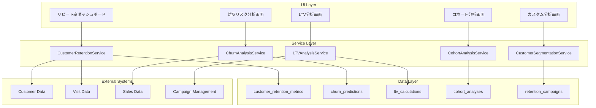

# Design Document

## Overview

顧客リピート率分析システムは、顧客の来店パターン、リピート率、離反リスク、顧客生涯価値（LTV）を包括的に分析し、データドリブンな顧客維持戦略の立案を支援します。既存の顧客・来店データを活用し、高度な統計分析とビジュアライゼーションを提供します。

## Architecture

### System Components



### Database Schema Design

#### 新規テーブル設計

**customer_retention_metrics (顧客維持指標)**

```sql
CREATE TABLE customer_retention_metrics (
    id UUID PRIMARY KEY DEFAULT gen_random_uuid(),
    customer_id UUID NOT NULL REFERENCES customers(id),
    analysis_date DATE NOT NULL,
    total_visits INTEGER NOT NULL DEFAULT 0,
    days_since_first_visit INTEGER NOT NULL DEFAULT 0,
    days_since_last_visit INTEGER NOT NULL DEFAULT 0,
    average_visit_interval DECIMAL(8,2),
    visit_frequency_score DECIMAL(5,2), -- 0-100スコア
    total_spent INTEGER NOT NULL DEFAULT 0,
    average_spend_per_visit INTEGER NOT NULL DEFAULT 0,
    ltv_current INTEGER NOT NULL DEFAULT 0,
    ltv_predicted INTEGER,
    retention_probability DECIMAL(5,4), -- 0-1の確率
    churn_risk_score DECIMAL(5,2), -- 0-100スコア
    customer_segment VARCHAR(20), -- 'new', 'regular', 'vip', 'at_risk', 'churned'
    last_calculated_at TIMESTAMPTZ NOT NULL DEFAULT now(),
    created_at TIMESTAMPTZ NOT NULL DEFAULT now(),
    UNIQUE(customer_id, analysis_date)
);
```

**churn_predictions (離反予測)**

```sql
CREATE TABLE churn_predictions (
    id UUID PRIMARY KEY DEFAULT gen_random_uuid(),
    customer_id UUID NOT NULL REFERENCES customers(id),
    prediction_date DATE NOT NULL,
    churn_probability DECIMAL(5,4) NOT NULL, -- 0-1の確率
    risk_level VARCHAR(10) NOT NULL, -- 'low', 'medium', 'high', 'critical'
    days_to_predicted_churn INTEGER,
    contributing_factors JSONB, -- 離反要因の詳細
    recommended_actions TEXT[],
    confidence_score DECIMAL(5,4),
    model_version VARCHAR(20),
    created_at TIMESTAMPTZ NOT NULL DEFAULT now(),
    UNIQUE(customer_id, prediction_date)
);
```

**ltv_calculations (LTV計算)**

```sql
CREATE TABLE ltv_calculations (
    id UUID PRIMARY KEY DEFAULT gen_random_uuid(),
    customer_id UUID NOT NULL REFERENCES customers(id),
    calculation_date DATE NOT NULL,
    historical_ltv INTEGER NOT NULL DEFAULT 0, -- 実績LTV
    predicted_ltv INTEGER, -- 予測LTV
    ltv_12_months INTEGER, -- 12ヶ月予測
    ltv_24_months INTEGER, -- 24ヶ月予測
    acquisition_cost INTEGER DEFAULT 0,
    roi_ratio DECIMAL(8,4), -- LTV/CAC
    payback_period_days INTEGER,
    customer_lifetime_days INTEGER,
    calculation_method VARCHAR(50),
    model_parameters JSONB,
    created_at TIMESTAMPTZ NOT NULL DEFAULT now(),
    UNIQUE(customer_id, calculation_date)
);
```

**cohort_analyses (コホート分析)**

```sql
CREATE TABLE cohort_analyses (
    id UUID PRIMARY KEY DEFAULT gen_random_uuid(),
    cohort_name VARCHAR(100) NOT NULL,
    cohort_period VARCHAR(20) NOT NULL, -- 'monthly', 'weekly', 'quarterly'
    cohort_start_date DATE NOT NULL,
    cohort_end_date DATE NOT NULL,
    total_customers INTEGER NOT NULL DEFAULT 0,
    analysis_data JSONB NOT NULL, -- 期間別維持率データ
    retention_rates JSONB NOT NULL, -- 期間別維持率
    revenue_data JSONB, -- 期間別売上データ
    analysis_type VARCHAR(50) NOT NULL, -- 'retention', 'revenue', 'behavior'
    created_by UUID REFERENCES staffs(id),
    created_at TIMESTAMPTZ NOT NULL DEFAULT now(),
    updated_at TIMESTAMPTZ NOT NULL DEFAULT now()
);
```

**retention_campaigns (維持施策)**

```sql
CREATE TABLE retention_campaigns (
    id UUID PRIMARY KEY DEFAULT gen_random_uuid(),
    campaign_name VARCHAR(200) NOT NULL,
    campaign_type VARCHAR(50) NOT NULL, -- 'email', 'sms', 'call', 'visit', 'discount'
    target_segment VARCHAR(50), -- 対象セグメント
    start_date DATE NOT NULL,
    end_date DATE,
    target_customers UUID[] DEFAULT '{}',
    campaign_cost INTEGER DEFAULT 0,
    success_metrics JSONB, -- 成功指標の定義
    actual_results JSONB, -- 実際の結果
    roi_calculation DECIMAL(8,4),
    status VARCHAR(20) DEFAULT 'planned', -- 'planned', 'active', 'completed', 'cancelled'
    created_by UUID REFERENCES staffs(id),
    created_at TIMESTAMPTZ NOT NULL DEFAULT now(),
    updated_at TIMESTAMPTZ NOT NULL DEFAULT now()
);
```

**customer_behavior_patterns (顧客行動パターン)**

```sql
CREATE TABLE customer_behavior_patterns (
    id UUID PRIMARY KEY DEFAULT gen_random_uuid(),
    customer_id UUID NOT NULL REFERENCES customers(id),
    pattern_date DATE NOT NULL,
    preferred_visit_days INTEGER[], -- 曜日パターン (0=日曜)
    preferred_visit_hours INTEGER[], -- 時間帯パターン
    average_stay_duration INTEGER, -- 平均滞在時間（分）
    preferred_cast_ids UUID[], -- よく指名するキャスト
    spending_pattern VARCHAR(20), -- 'consistent', 'increasing', 'decreasing', 'volatile'
    seasonal_preferences JSONB, -- 季節別の傾向
    social_pattern VARCHAR(20), -- 'solo', 'group', 'mixed'
    created_at TIMESTAMPTZ NOT NULL DEFAULT now(),
    updated_at TIMESTAMPTZ NOT NULL DEFAULT now(),
    UNIQUE(customer_id, pattern_date)
);
```

## Components and Interfaces

### Service Layer Components

#### CustomerRetentionService

顧客維持分析の中核を担当するサービス

**主要メソッド:**

- `calculateRetentionMetrics(dateRange: DateRange): Promise<RetentionMetrics>`
- `getCustomerSegmentation(date: Date): Promise<CustomerSegmentation>`
- `analyzeVisitPatterns(customerId: string, dateRange: DateRange): Promise<VisitPattern>`
- `generateRetentionReport(filters: RetentionFilters): Promise<RetentionReport>`
- `updateRetentionMetrics(customerIds?: string[]): Promise<void>`

#### ChurnAnalysisService

離反分析と予測を担当するサービス

**主要メソッド:**

- `predictChurnRisk(customerId: string): Promise<ChurnPrediction>`
- `identifyAtRiskCustomers(riskLevel: string): Promise<AtRiskCustomer[]>`
- `analyzeChurnFactors(dateRange: DateRange): Promise<ChurnFactorAnalysis>`
- `generateChurnPreventionRecommendations(customerId: string): Promise<Recommendation[]>`
- `trackChurnPreventionEffectiveness(campaignId: string): Promise<EffectivenessReport>`

#### LTVAnalysisService

顧客生涯価値分析を担当するサービス

**主要メソッド:**

- `calculateCustomerLTV(customerId: string, method: string): Promise<LTVCalculation>`
- `predictFutureLTV(customerId: string, months: number): Promise<LTVPrediction>`
- `analyzeAcquisitionROI(acquisitionChannel: string, dateRange: DateRange): Promise<ROIAnalysis>`
- `segmentCustomersByLTV(dateRange: DateRange): Promise<LTVSegmentation>`
- `generateLTVReport(filters: LTVFilters): Promise<LTVReport>`

#### CohortAnalysisService

コホート分析を担当するサービス

**主要メソッド:**

- `createCohortAnalysis(cohortDefinition: CohortDefinition): Promise<CohortAnalysis>`
- `calculateRetentionRates(cohortId: string): Promise<RetentionRates>`
- `analyzeRevenueBycohort(cohortId: string): Promise<CohortRevenue>`
- `compareCohorts(cohortIds: string[]): Promise<CohortComparison>`
- `generateCohortReport(analysisType: string, dateRange: DateRange): Promise<CohortReport>`

#### CustomerSegmentationService

顧客セグメンテーションを担当するサービス

**主要メソッド:**

- `segmentCustomers(criteria: SegmentationCriteria): Promise<CustomerSegments>`
- `analyzeSegmentBehavior(segmentId: string): Promise<SegmentBehaviorAnalysis>`
- `trackSegmentMigration(dateRange: DateRange): Promise<SegmentMigration>`
- `recommendSegmentStrategies(segmentId: string): Promise<SegmentStrategy[]>`
- `measureSegmentPerformance(segmentId: string, dateRange: DateRange): Promise<SegmentPerformance>`

### UI Components

#### RetentionDashboard

リピート率分析のメインダッシュボード

**機能:**

- 期間別リピート率の表示
- 顧客セグメント分布の表示
- 主要KPIの表示
- トレンド分析グラフ

#### ChurnRiskAnalysisPanel

離反リスク分析パネル

**機能:**

- 高リスク顧客一覧
- 離反予測モデルの結果表示
- 推奨アクションの表示
- リスクスコア分布

#### LTVAnalyticsDashboard

LTV分析ダッシュボード

**機能:**

- 顧客別LTV表示
- セグメント別LTV比較
- ROI分析結果
- 予測LTVグラフ

#### CohortAnalysisVisualization

コホート分析の可視化コンポーネント

**機能:**

- コホートテーブル表示
- 維持率ヒートマップ
- 期間別比較グラフ
- カスタムコホート作成

#### CustomerBehaviorAnalytics

顧客行動分析コンポーネント

**機能:**

- 行動パターンの可視化
- 季節性分析グラフ
- 時間帯別分析
- 個別顧客行動詳細

## Data Models

### Core Types

```typescript
interface RetentionMetrics {
  totalCustomers: number;
  newCustomers: number;
  returningCustomers: number;
  churnedCustomers: number;
  retentionRate: number;
  churnRate: number;
  averageVisitInterval: number;
  customerLifetime: number;
}

interface CustomerSegmentation {
  segments: {
    new: CustomerSegment;
    regular: CustomerSegment;
    vip: CustomerSegment;
    atRisk: CustomerSegment;
    churned: CustomerSegment;
  };
  totalCustomers: number;
  segmentationDate: Date;
}

interface CustomerSegment {
  name: string;
  count: number;
  percentage: number;
  averageLTV: number;
  averageVisitFrequency: number;
  characteristics: string[];
}

interface ChurnPrediction {
  customerId: string;
  customer: Customer;
  churnProbability: number;
  riskLevel: "low" | "medium" | "high" | "critical";
  daysToPredictedChurn?: number;
  contributingFactors: ChurnFactor[];
  recommendedActions: string[];
  confidenceScore: number;
  predictionDate: Date;
}

interface ChurnFactor {
  factor: string;
  impact: number; // -1 to 1
  description: string;
}

interface LTVCalculation {
  customerId: string;
  customer: Customer;
  historicalLTV: number;
  predictedLTV?: number;
  ltv12Months?: number;
  ltv24Months?: number;
  acquisitionCost: number;
  roiRatio: number;
  paybackPeriodDays?: number;
  customerLifetimeDays: number;
  calculationMethod: string;
  calculationDate: Date;
}

interface CohortAnalysis {
  id: string;
  cohortName: string;
  cohortPeriod: "monthly" | "weekly" | "quarterly";
  cohortStartDate: Date;
  cohortEndDate: Date;
  totalCustomers: number;
  retentionRates: { [period: string]: number };
  revenueData?: { [period: string]: number };
  analysisType: "retention" | "revenue" | "behavior";
}

interface VisitPattern {
  customerId: string;
  averageVisitInterval: number;
  visitFrequency: number;
  preferredDays: number[];
  preferredHours: number[];
  seasonalTrends: SeasonalTrend[];
  spendingPattern: "consistent" | "increasing" | "decreasing" | "volatile";
}

interface SeasonalTrend {
  period: string; // 'spring', 'summer', 'autumn', 'winter'
  visitFrequency: number;
  averageSpending: number;
  trend: "increasing" | "decreasing" | "stable";
}

interface RetentionCampaign {
  id: string;
  campaignName: string;
  campaignType: string;
  targetSegment: string;
  startDate: Date;
  endDate?: Date;
  targetCustomers: string[];
  campaignCost: number;
  successMetrics: { [metric: string]: any };
  actualResults?: { [metric: string]: any };
  roiCalculation?: number;
  status: "planned" | "active" | "completed" | "cancelled";
}
```

## Error Handling

### Data Quality Assurance

1. **データ整合性チェック**
   - 来店データの欠損・重複検出
   - 売上データとの整合性確認
   - 顧客データの品質チェック

2. **計算精度の確保**
   - 統計計算の検証
   - 予測モデルの精度監視
   - 異常値の検出・除外

3. **レポート信頼性**
   - 信頼区間の表示
   - サンプルサイズの妥当性確認
   - 計算根拠の透明性

### Error Recovery

- データ品質問題の自動修正
- 計算エラー時の代替手法適用
- 不完全データでの部分分析実行
- 手動データ修正インターフェース

## Testing Strategy

### Unit Tests

1. **分析サービス**
   - 各種計算ロジックのテスト
   - 統計関数の精度テスト
   - エッジケースの処理テスト

2. **予測モデル**
   - モデル精度のテスト
   - 予測結果の妥当性テスト
   - モデル更新のテスト

### Integration Tests

1. **データ連携**
   - 既存システムとのデータ連携テスト
   - リアルタイム更新のテスト
   - 大量データ処理のテスト

2. **レポート生成**
   - 複雑なレポート生成のテスト
   - パフォーマンステスト
   - 同時アクセステスト

### Performance Tests

1. **大規模データ処理**
   - 数万件の顧客データ処理
   - 複雑な統計計算の処理速度
   - レポート生成時間の測定

## Security Considerations

### Data Privacy

- 顧客分析データの匿名化
- 個人識別情報の保護
- アクセスログの記録

### Access Control

- 分析結果へのロールベースアクセス
- 機密性の高いデータの制限
- 外部出力の制御

## Performance Optimization

### Database Optimization

- 分析用インデックスの最適化
- 集計テーブルの活用
- クエリパフォーマンスの向上

### Calculation Optimization

- バッチ処理による効率化
- キャッシュ戦略の実装
- 並列処理の活用

### UI Performance

- 大量データ表示の最適化
- 非同期レポート生成
- プログレッシブローディング

## Machine Learning Integration

### 予測モデル

1. **離反予測モデル**
   - ロジスティック回帰
   - ランダムフォレスト
   - 勾配ブースティング

2. **LTV予測モデル**
   - 線形回帰
   - 時系列分析
   - 生存分析

3. **セグメンテーションモデル**
   - クラスタリング（K-means, DBSCAN）
   - 階層クラスタリング
   - 混合ガウスモデル

### モデル管理

- モデルバージョン管理
- 性能監視・再学習
- A/Bテストによる比較評価
