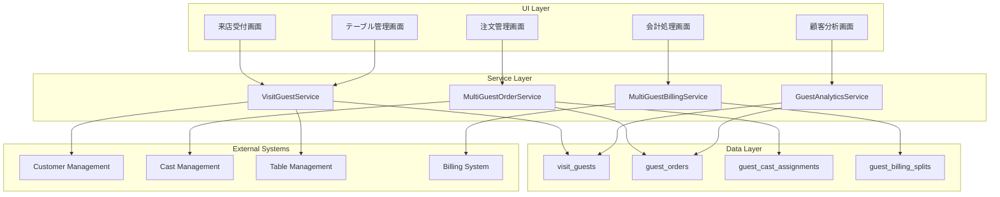

# Design Document

## Overview

複数客の会計管理システムは、1組の来店に複数の顧客が含まれる場合の正確な管理を実現します。現在の単一顧客モデルから、柔軟な多対多関係モデルに拡張し、個別の消費追跡、担当キャストの紐付け、柔軟な会計処理を可能にします。

## Architecture

### System Components



### Database Schema Design

#### 新規テーブル設計

**visit_guests (来店ゲスト)**

```sql
CREATE TABLE visit_guests (
    id UUID PRIMARY KEY DEFAULT gen_random_uuid(),
    visit_id UUID NOT NULL REFERENCES visits(id) ON DELETE CASCADE,
    customer_id UUID NOT NULL REFERENCES customers(id),
    guest_type VARCHAR(20) NOT NULL DEFAULT 'main', -- 'main', 'companion', 'additional'
    seat_position INTEGER,
    relationship_to_main VARCHAR(50), -- '友人', '同僚', '部下' etc.
    is_primary_payer BOOLEAN NOT NULL DEFAULT false,
    check_in_time TIMESTAMPTZ NOT NULL DEFAULT now(),
    check_out_time TIMESTAMPTZ,
    individual_subtotal INTEGER NOT NULL DEFAULT 0,
    individual_service_charge INTEGER NOT NULL DEFAULT 0,
    individual_tax_amount INTEGER NOT NULL DEFAULT 0,
    individual_total INTEGER NOT NULL DEFAULT 0,
    notes TEXT,
    created_by UUID REFERENCES staffs(id),
    created_at TIMESTAMPTZ NOT NULL DEFAULT now(),
    updated_at TIMESTAMPTZ NOT NULL DEFAULT now()
);
```

**guest_orders (ゲスト別注文)**

```sql
CREATE TABLE guest_orders (
    id UUID PRIMARY KEY DEFAULT gen_random_uuid(),
    visit_guest_id UUID NOT NULL REFERENCES visit_guests(id) ON DELETE CASCADE,
    order_item_id BIGINT NOT NULL REFERENCES order_items(id) ON DELETE CASCADE,
    quantity_for_guest INTEGER NOT NULL DEFAULT 1,
    amount_for_guest INTEGER NOT NULL DEFAULT 0,
    is_shared_item BOOLEAN NOT NULL DEFAULT false,
    shared_percentage DECIMAL(5,2), -- シェア商品の場合の負担割合
    created_at TIMESTAMPTZ NOT NULL DEFAULT now(),
    UNIQUE(visit_guest_id, order_item_id)
);
```

**guest_cast_assignments (ゲスト-キャスト担当関係)**

```sql
CREATE TABLE guest_cast_assignments (
    id UUID PRIMARY KEY DEFAULT gen_random_uuid(),
    visit_guest_id UUID NOT NULL REFERENCES visit_guests(id) ON DELETE CASCADE,
    cast_id UUID NOT NULL REFERENCES casts_profile(id),
    assignment_type VARCHAR(20) NOT NULL, -- 'shimei', 'dohan', 'after', 'help'
    start_time TIMESTAMPTZ NOT NULL DEFAULT now(),
    end_time TIMESTAMPTZ,
    is_primary_assignment BOOLEAN NOT NULL DEFAULT false,
    notes TEXT,
    created_by UUID REFERENCES staffs(id),
    created_at TIMESTAMPTZ NOT NULL DEFAULT now()
);
```

**guest_billing_splits (ゲスト別会計分割)**

```sql
CREATE TABLE guest_billing_splits (
    id UUID PRIMARY KEY DEFAULT gen_random_uuid(),
    visit_id UUID NOT NULL REFERENCES visits(id) ON DELETE CASCADE,
    visit_guest_id UUID NOT NULL REFERENCES visit_guests(id),
    split_type VARCHAR(20) NOT NULL, -- 'individual', 'shared', 'treated'
    split_amount INTEGER NOT NULL DEFAULT 0,
    payment_method payment_method,
    payment_status payment_status NOT NULL DEFAULT 'pending',
    paid_at TIMESTAMPTZ,
    notes TEXT,
    processed_by UUID REFERENCES staffs(id),
    created_at TIMESTAMPTZ NOT NULL DEFAULT now(),
    updated_at TIMESTAMPTZ NOT NULL DEFAULT now()
);
```

#### 既存テーブルの拡張

**visits テーブルの拡張**

```sql
ALTER TABLE visits
ADD COLUMN total_guests INTEGER NOT NULL DEFAULT 1,
ADD COLUMN billing_type VARCHAR(20) NOT NULL DEFAULT 'single', -- 'single', 'split', 'mixed'
ADD COLUMN primary_customer_id UUID REFERENCES customers(id);
```

**order_items テーブルの拡張**

```sql
ALTER TABLE order_items
ADD COLUMN is_shared_item BOOLEAN NOT NULL DEFAULT false,
ADD COLUMN target_guest_id UUID REFERENCES visit_guests(id);
```

## Components and Interfaces

### Service Layer Components

#### VisitGuestService

来店ゲストの管理を担当するサービス

**主要メソッド:**

- `addGuestToVisit(visitId: string, customerData: CustomerInput, guestType: string): Promise<VisitGuest>`
- `updateGuestInfo(guestId: string, updateData: Partial<VisitGuestInput>): Promise<VisitGuest>`
- `getVisitGuests(visitId: string): Promise<VisitGuest[]>`
- `checkOutGuest(guestId: string, checkOutTime: Date): Promise<void>`
- `transferGuestToNewVisit(guestId: string, newVisitId: string): Promise<void>`

#### MultiGuestOrderService

複数ゲストの注文管理を担当するサービス

**主要メソッド:**

- `createGuestOrder(visitGuestId: string, orderData: OrderInput): Promise<GuestOrder>`
- `assignOrderToGuest(orderItemId: number, guestId: string, quantity: number): Promise<void>`
- `createSharedOrder(visitId: string, orderData: OrderInput, guestShares: GuestShare[]): Promise<void>`
- `updateOrderAssignment(guestOrderId: string, newAssignment: OrderAssignmentInput): Promise<void>`
- `getGuestOrders(visitGuestId: string): Promise<GuestOrder[]>`

#### MultiGuestBillingService

複数ゲストの会計処理を担当するサービス

**主要メソッド:**

- `calculateIndividualBills(visitId: string): Promise<IndividualBill[]>`
- `processSplitBilling(visitId: string, splitData: BillingSplitInput[]): Promise<BillingSplit[]>`
- `processIndividualPayment(guestId: string, paymentData: PaymentInput): Promise<void>`
- `generateGroupBill(visitId: string): Promise<GroupBill>`
- `validateBillingConsistency(visitId: string): Promise<ValidationResult>`

#### GuestAnalyticsService

ゲスト分析とレポート生成を担当するサービス

**主要メソッド:**

- `generateGuestConsumptionReport(customerId: string, dateRange: DateRange): Promise<ConsumptionReport>`
- `analyzeCastGuestRelationships(castId: string, dateRange: DateRange): Promise<RelationshipAnalysis>`
- `getGroupVisitPatterns(dateRange: DateRange): Promise<GroupPattern[]>`
- `calculateCastContributionByGuest(castId: string, dateRange: DateRange): Promise<ContributionAnalysis>`

### UI Components

#### MultiGuestReceptionForm

来店受付時の複数ゲスト登録フォーム

**機能:**

- 主要顧客の選択・登録
- 同伴者の追加・情報入力
- 席順・関係性の設定
- テーブル割り当て

#### GuestOrderManagement

ゲスト別注文管理コンポーネント

**機能:**

- ゲスト選択UI
- 個別注文・共有注文の区別
- 担当キャストの割り当て
- 注文履歴の表示

#### MultiGuestBillingInterface

複数ゲスト会計処理インターフェース

**機能:**

- ゲスト別消費明細表示
- 会計方法選択（個別/合算/分割）
- 支払い方法の個別設定
- 会計状況のリアルタイム表示

#### GroupTableManagement

グループテーブル管理コンポーネント

**機能:**

- テーブル別ゲスト情報表示
- 担当キャスト状況表示
- 部分退店処理
- テーブル移動機能

## Data Models

### Core Types

```typescript
interface VisitGuest {
  id: string;
  visitId: string;
  customerId: string;
  customer: Customer;
  guestType: "main" | "companion" | "additional";
  seatPosition?: number;
  relationshipToMain?: string;
  isPrimaryPayer: boolean;
  checkInTime: Date;
  checkOutTime?: Date;
  individualSubtotal: number;
  individualServiceCharge: number;
  individualTaxAmount: number;
  individualTotal: number;
  orders: GuestOrder[];
  castAssignments: GuestCastAssignment[];
}

interface GuestOrder {
  id: string;
  visitGuestId: string;
  orderItemId: number;
  orderItem: OrderItem;
  quantityForGuest: number;
  amountForGuest: number;
  isSharedItem: boolean;
  sharedPercentage?: number;
}

interface GuestCastAssignment {
  id: string;
  visitGuestId: string;
  castId: string;
  cast: Cast;
  assignmentType: "shimei" | "dohan" | "after" | "help";
  startTime: Date;
  endTime?: Date;
  isPrimaryAssignment: boolean;
  notes?: string;
}

interface BillingSplit {
  id: string;
  visitId: string;
  visitGuestId: string;
  guest: VisitGuest;
  splitType: "individual" | "shared" | "treated";
  splitAmount: number;
  paymentMethod?: string;
  paymentStatus: "pending" | "completed" | "cancelled";
  paidAt?: Date;
}

interface GroupBill {
  visitId: string;
  totalAmount: number;
  guestBills: IndividualBill[];
  sharedItems: SharedItem[];
  billingType: "individual" | "split" | "group";
}

interface IndividualBill {
  guestId: string;
  guest: VisitGuest;
  individualItems: GuestOrder[];
  sharedItemsPortion: number;
  subtotal: number;
  serviceCharge: number;
  taxAmount: number;
  total: number;
}
```

## Error Handling

### Data Consistency Validation

1. **ゲスト-注文整合性**
   - 全注文が適切なゲストに割り当てられているか
   - 共有アイテムの割合合計が100%になっているか
   - 注文金額とゲスト別金額の整合性

2. **会計整合性**
   - 個別会計の合計が全体金額と一致するか
   - 支払い状況の整合性
   - 未払い金額の追跡

3. **キャスト割り当て整合性**
   - 同時間帯の重複割り当てチェック
   - 指名関係の論理的整合性
   - 担当時間の妥当性

### Error Recovery

- 部分的なデータ不整合の自動修正
- 会計エラー時の安全な状態復旧
- データ移行時の段階的ロールバック
- 手動修正インターフェースの提供

## Testing Strategy

### Unit Tests

1. **VisitGuestService**
   - ゲスト追加・更新・削除のテスト
   - データ整合性チェックのテスト
   - エラーケースの処理テスト

2. **MultiGuestBillingService**
   - 個別会計計算のテスト
   - 分割会計計算のテスト
   - 会計整合性検証のテスト

### Integration Tests

1. **複数ゲスト来店フロー**
   - 受付から会計完了までの全フロー
   - 部分退店処理のテスト
   - データ整合性の維持テスト

2. **既存システム連携**
   - 顧客管理システムとの連携
   - キャスト管理システムとの連携
   - 会計システムとの連携

### Performance Tests

1. **大規模グループ処理**
   - 10名以上のグループ処理
   - 複雑な分割会計の処理速度
   - 同時多グループの処理

## Security Considerations

### Access Control

- ゲスト情報へのアクセス制限
- 会計情報の閲覧権限管理
- 個人情報の保護

### Data Protection

- ゲスト関係情報の暗号化
- 会計データの改ざん防止
- 個人識別情報の匿名化

## Performance Optimization

### Database Optimization

- 複合インデックスの最適化
- クエリパフォーマンスの向上
- 大量データ処理の効率化

### UI Performance

- 大規模グループ表示の最適化
- リアルタイム更新の効率化
- レスポンシブデザインの最適化

## Migration Strategy

### データ移行計画

1. **段階的移行**
   - 既存単一顧客データの主要ゲスト化
   - 新規来店から新システム適用
   - 過去データの段階的変換

2. **整合性保証**
   - 移行前後のデータ検証
   - ロールバック機能の実装
   - 移行ログの詳細記録

3. **ユーザートレーニング**
   - 新機能の操作研修
   - 移行期間中のサポート体制
   - マニュアルの整備
