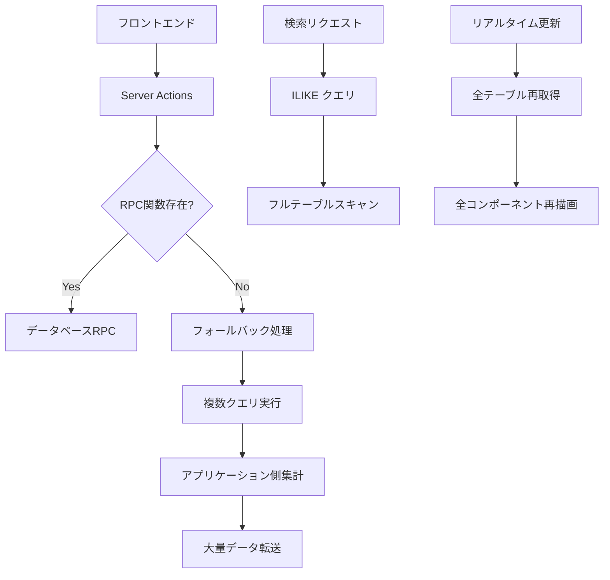
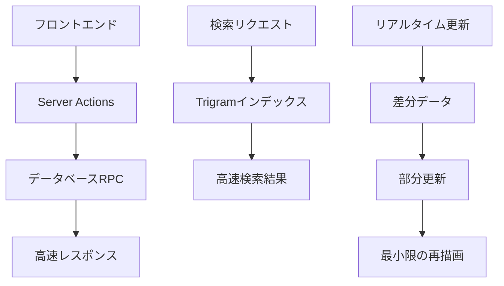

# システムパフォーマンス最適化 - 設計書

## 概要

本設計書では、システムパフォーマンス最適化の要件に基づき、具体的な技術的解決策とアーキテクチャの改善案を定義します。主要な改善領域は、データベースアクセスパターンの最適化、検索機能の高速化、リアルタイム更新の効率化、フロントエンドコンポーネントの最適化です。

## アーキテクチャ

### 現在のアーキテクチャの問題点



### 最適化後のアーキテクチャ



## コンポーネント設計

### 1. データベース最適化層

#### 1.1 フォールバック処理の削除

**対象ファイル:**

- `src/app/(protected)/dashboard/actions.ts`
- `src/services/attendance/attendance-reporting.service.ts`
- その他のサービスファイル

**設計方針:**

- 全てのフォールバック関数を削除
- RPC関数の呼び出しに失敗した場合は適切なエラーハンドリング
- 開発環境でのスキーマ不整合の早期検出

**実装パターン:**

```typescript
// 修正前（非効率）
async function getDashboardStats() {
  try {
    const { data, error } = await supabase.rpc("get_dashboard_stats");
    if (error && error.message.includes("function get_dashboard_stats")) {
      return getDashboardStatsFallback(); // 非効率な処理
    }
    return data;
  } catch (error) {
    return getDashboardStatsFallback();
  }
}

// 修正後（効率的）
async function getDashboardStats() {
  const { data, error } = await supabase.rpc("get_dashboard_stats");
  if (error) {
    throw new Error(`Dashboard stats RPC failed: ${error.message}`);
  }
  return data;
}
```

#### 1.2 インデックス最適化

**Trigramインデックスの実装:**

```sql
-- PostgreSQL拡張機能の有効化
CREATE EXTENSION IF NOT EXISTS pg_trgm;

-- 顧客検索用GINインデックス
CREATE INDEX idx_customers_search ON customers
USING gin (
  name gin_trgm_ops,
  name_kana gin_trgm_ops,
  phone_number gin_trgm_ops,
  line_id gin_trgm_ops
);

-- スタッフ検索用GINインデックス
CREATE INDEX idx_staffs_search ON staffs
USING gin (
  full_name gin_trgm_ops,
  full_name_kana gin_trgm_ops
);

-- 日付範囲検索用インデックス
CREATE INDEX idx_visits_date_range ON visits (check_in_at, status);
CREATE INDEX idx_attendance_date_range ON attendance_records (work_date, staff_id);
```

### 2. リアルタイム更新最適化

#### 2.1 差分更新システム

**現在の問題:**

```typescript
// 非効率: 全データ再取得
subscribeToAllTableUpdates(callback: (tables: Table[]) => void) {
  this.supabase.channel("all-table-updates")
    .on("postgres_changes", { event: "*" }, async () => {
      const tables = await this.searchTables(); // 全件取得
      callback(tables);
    });
}
```

**最適化後の設計:**

```typescript
// 効率的: 差分更新
subscribeToTableUpdates(
  onUpdate: (updatedTable: Table) => void,
  onInitialLoad: (allTables: Table[]) => void
) {
  // 初回ロード
  this.searchTables().then(onInitialLoad);

  // 差分更新
  this.supabase.channel("table-updates")
    .on("postgres_changes", {
      event: "UPDATE",
      schema: "public",
      table: "tables"
    }, (payload) => {
      const updatedTable = this.mapToTable(payload.new);
      onUpdate(updatedTable);
    });
}
```

#### 2.2 フロントエンド状態管理の最適化

**React状態管理パターン:**

```typescript
// 最適化されたリアルタイムコンポーネント
function OptimizedRealTimeTableDashboard() {
  const [tables, setTables] = useState<Map<string, Table>>(new Map());

  useEffect(() => {
    const unsubscribe = tableService.subscribeToTableUpdates(
      // 単一テーブル更新
      (updatedTable) => {
        setTables(prev => new Map(prev.set(updatedTable.id, updatedTable)));
      },
      // 初回全件ロード
      (allTables) => {
        const tableMap = new Map(allTables.map(t => [t.id, t]));
        setTables(tableMap);
      }
    );

    return unsubscribe;
  }, []);

  return (
    <div>
      {Array.from(tables.values()).map(table => (
        <MemoizedTableCard key={table.id} table={table} />
      ))}
    </div>
  );
}

// メモ化されたテーブルカード
const MemoizedTableCard = React.memo(({ table }: { table: Table }) => {
  return <TableCard table={table} />;
});
```

### 3. コンポーネント最適化

#### 3.1 大きなコンポーネントの分割

**対象:** `AttendanceClient.tsx`

**分割戦略:**

```typescript
// 修正前: 巨大なコンポーネント
function AttendanceClient() {
  // 全ての状態とロジックが混在
  const [activeTab, setActiveTab] = useState("dashboard");
  const [dashboardData, setDashboardData] = useState();
  const [scheduleData, setScheduleData] = useState();
  // ... 多数の状態

  return (
    <div>
      {activeTab === "dashboard" && <DashboardContent />}
      {activeTab === "schedule" && <ScheduleContent />}
      {/* ... */}
    </div>
  );
}

// 修正後: 責務分離
function AttendanceClient() {
  const [activeTab, setActiveTab] = useState("dashboard");

  return (
    <div>
      <TabNavigation activeTab={activeTab} onTabChange={setActiveTab} />
      <Suspense fallback={<LoadingSpinner />}>
        {activeTab === "dashboard" && <AttendanceDashboard />}
        {activeTab === "schedule" && <AttendanceSchedule />}
        {activeTab === "timeclock" && <AttendanceTimeClock />}
        {activeTab === "requests" && <AttendanceRequests />}
      </Suspense>
    </div>
  );
}

// 各タブは独立したコンポーネント
function AttendanceDashboard() {
  const { data, isLoading } = useAttendanceDashboard();
  // 必要なデータのみを管理
}
```

#### 3.2 仮想化とメモ化の実装

**リスト表示の最適化:**

```typescript
import { FixedSizeList as List } from 'react-window';

function OptimizedCustomerList({ customers }: { customers: Customer[] }) {
  const Row = useCallback(({ index, style }: { index: number, style: React.CSSProperties }) => (
    <div style={style}>
      <MemoizedCustomerRow customer={customers[index]} />
    </div>
  ), [customers]);

  return (
    <List
      height={600}
      itemCount={customers.length}
      itemSize={80}
      width="100%"
    >
      {Row}
    </List>
  );
}

const MemoizedCustomerRow = React.memo(({ customer }: { customer: Customer }) => {
  return (
    <div className="customer-row">
      {/* 顧客情報の表示 */}
    </div>
  );
});
```

### 4. 並列処理最適化

#### 4.1 Promise.allの活用

**修正対象の特定:**

```typescript
// 非効率な直列処理
async function loadDashboardData() {
  const stats = await getStats();
  const alerts = await getAlerts();
  const activities = await getActivities();
  return { stats, alerts, activities };
}

// 効率的な並列処理
async function loadDashboardData() {
  const [stats, alerts, activities] = await Promise.all([
    getStats(),
    getAlerts(),
    getActivities(),
  ]);
  return { stats, alerts, activities };
}
```

#### 4.2 エラーハンドリングの改善

**堅牢な並列処理:**

```typescript
async function loadDashboardDataWithErrorHandling() {
  const results = await Promise.allSettled([
    getStats(),
    getAlerts(),
    getActivities(),
  ]);

  return {
    stats: results[0].status === "fulfilled" ? results[0].value : null,
    alerts: results[1].status === "fulfilled" ? results[1].value : [],
    activities: results[2].status === "fulfilled" ? results[2].value : [],
    errors: results
      .filter((r) => r.status === "rejected")
      .map((r) => (r as PromiseRejectedResult).reason),
  };
}
```

## データモデル

### 最適化されたクエリパターン

#### 1. 集計クエリの最適化

**RPC関数の活用:**

```sql
-- ダッシュボード統計の高速取得
CREATE OR REPLACE FUNCTION get_optimized_dashboard_stats(report_date DATE)
RETURNS TABLE (
  today_customers BIGINT,
  today_sales NUMERIC,
  today_visits BIGINT,
  active_tables BIGINT
) AS $$
BEGIN
  RETURN QUERY
  WITH stats AS (
    SELECT
      COUNT(DISTINCT c.id) as customer_count,
      COALESCE(SUM(oi.total_price), 0) as total_sales,
      COUNT(DISTINCT v.id) as visit_count
    FROM visits v
    LEFT JOIN customers c ON v.customer_id = c.id
    LEFT JOIN order_items oi ON v.id = oi.visit_id
    WHERE DATE(v.check_in_at) = report_date
  )
  SELECT
    s.customer_count,
    s.total_sales,
    s.visit_count,
    (SELECT COUNT(*) FROM tables WHERE current_status != 'available')::BIGINT
  FROM stats s;
END;
$$ LANGUAGE plpgsql;
```

#### 2. 検索クエリの最適化

**Trigramを活用した高速検索:**

```sql
-- 顧客検索の最適化
CREATE OR REPLACE FUNCTION search_customers_optimized(
  search_term TEXT,
  limit_count INTEGER DEFAULT 20,
  offset_count INTEGER DEFAULT 0
)
RETURNS TABLE (
  id UUID,
  name TEXT,
  name_kana TEXT,
  phone_number TEXT,
  similarity REAL
) AS $$
BEGIN
  RETURN QUERY
  SELECT
    c.id,
    c.name,
    c.name_kana,
    c.phone_number,
    GREATEST(
      similarity(c.name, search_term),
      similarity(c.name_kana, search_term),
      similarity(c.phone_number, search_term)
    ) as sim
  FROM customers c
  WHERE
    c.name % search_term OR
    c.name_kana % search_term OR
    c.phone_number % search_term
  ORDER BY sim DESC
  LIMIT limit_count
  OFFSET offset_count;
END;
$$ LANGUAGE plpgsql;
```

## エラーハンドリング

### 1. データベースエラーの処理

**統一されたエラーハンドリング:**

```typescript
class DatabaseError extends Error {
  constructor(
    message: string,
    public code: string,
    public details?: unknown
  ) {
    super(message);
    this.name = "DatabaseError";
  }
}

function handleDatabaseError(error: PostgrestError): never {
  if (error.code === "42883") {
    throw new DatabaseError(
      "Required database function is missing. Please run migrations.",
      "MISSING_FUNCTION",
      error
    );
  }

  if (error.code === "PGRST116") {
    throw new DatabaseError("Record not found", "NOT_FOUND", error);
  }

  throw new DatabaseError(
    `Database operation failed: ${error.message}`,
    error.code || "UNKNOWN",
    error
  );
}
```

### 2. リアルタイム接続エラーの処理

**接続復旧機能:**

```typescript
class RealtimeConnectionManager {
  private retryCount = 0;
  private maxRetries = 5;
  private baseDelay = 1000;

  async connectWithRetry(callback: () => Promise<void>): Promise<void> {
    try {
      await callback();
      this.retryCount = 0; // 成功時はリセット
    } catch (error) {
      if (this.retryCount >= this.maxRetries) {
        throw new Error("Maximum retry attempts reached");
      }

      const delay = this.baseDelay * Math.pow(2, this.retryCount);
      this.retryCount++;

      await new Promise((resolve) => setTimeout(resolve, delay));
      return this.connectWithRetry(callback);
    }
  }
}
```

## テスト戦略

### 1. パフォーマンステスト

**データベースクエリのベンチマーク:**

```typescript
describe("Database Performance Tests", () => {
  test("Dashboard stats should load within 1 second", async () => {
    const startTime = Date.now();
    await getDashboardStats();
    const endTime = Date.now();

    expect(endTime - startTime).toBeLessThan(1000);
  });

  test("Customer search should handle 10k records efficiently", async () => {
    // 10,000件のテストデータを作成
    await createTestCustomers(10000);

    const startTime = Date.now();
    const results = await searchCustomers({ query: "テスト" });
    const endTime = Date.now();

    expect(endTime - startTime).toBeLessThan(500);
    expect(results.length).toBeGreaterThan(0);
  });
});
```

### 2. リアルタイム機能のテスト

**WebSocket接続のテスト:**

```typescript
describe("Realtime Updates", () => {
  test("Should receive table updates in real-time", async () => {
    const updates: Table[] = [];

    const unsubscribe = tableService.subscribeToTableUpdates(
      (table) => updates.push(table),
      () => {}
    );

    // テーブル状態を変更
    await tableService.updateTableStatus("table-1", "occupied");

    // 更新が受信されるまで待機
    await waitFor(() => {
      expect(updates).toHaveLength(1);
      expect(updates[0].currentStatus).toBe("occupied");
    });

    unsubscribe();
  });
});
```

## セキュリティ考慮事項

### 1. RPC関数のセキュリティ

**適切な権限制御:**

```sql
-- RPC関数にRLSを適用
CREATE OR REPLACE FUNCTION get_dashboard_stats(report_date DATE)
RETURNS TABLE (...)
SECURITY DEFINER -- 関数定義者の権限で実行
SET search_path = public
AS $$
BEGIN
  -- 現在のユーザーが管理者権限を持つかチェック
  IF NOT is_admin_or_manager() THEN
    RAISE EXCEPTION 'Insufficient privileges';
  END IF;

  -- 統計データを返す
  RETURN QUERY ...;
END;
$$ LANGUAGE plpgsql;
```

### 2. 検索機能のセキュリティ

**SQLインジェクション対策:**

```typescript
// パラメータ化クエリの使用
async function searchCustomersSecure(searchTerm: string) {
  // 入力値の検証
  if (!searchTerm || searchTerm.length < 2) {
    throw new Error("Search term must be at least 2 characters");
  }

  // エスケープ処理
  const sanitizedTerm = searchTerm.replace(/[%_]/g, "\\$&");

  const { data, error } = await supabase.rpc("search_customers_optimized", {
    search_term: sanitizedTerm,
  });

  if (error) throw error;
  return data;
}
```
