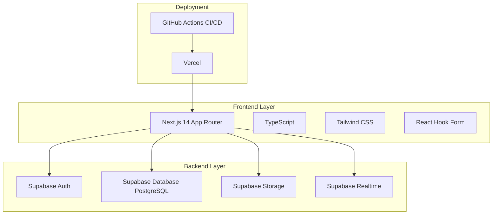
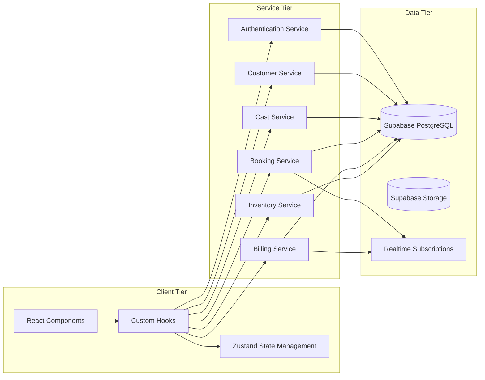
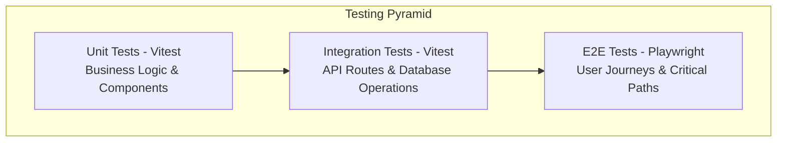

# Design Document

## Overview

platinum-managementシステムは、Next.js + TypeScript + Supabaseを使用したモダンなWebアプリケーションです。TDD駆動開発により高品質なコードを維持し、段階的な機能実装を通じてキャバクラ運営の業務効率化を実現します。

システムは以下の特徴を持ちます：
- **リアルタイム同期**: Supabase Realtimeによる席状況・予約情報の即座な反映
- **ロールベースアクセス制御**: RLS（Row Level Security）による厳格な権限管理
- **段階的導入**: MVP → 効率化 → 拡張の3フェーズ構成
- **高品質保証**: TDD + Code Hooks による100%テストカバレッジ

## Architecture

### Technology Stack



### System Architecture



## Components and Interfaces

### Core Domain Models

```typescript
// User Authentication & Authorization
interface User {
  id: string;
  email: string;
  role: UserRole;
  staffId?: string;
}

type UserRole = 'admin' | 'manager' | 'hall' | 'cashier' | 'cast';

// Staff Management
interface Staff {
  id: string;
  userId: string;
  fullName: string;
  role: UserRole;
  hireDate: Date;
  isActive: boolean;
}

interface CastProfile {
  staffId: string;
  nickname: string;
  profileImageUrl?: string;
  bio?: string;
  hourlyWage: number;
  commissionRate: CommissionRate;
}

interface CommissionRate {
  shimei: number;
  bottlePercent: number;
}

// Customer Management
interface Customer {
  id: string;
  name: string;
  phoneNumber?: string;
  lineId?: string;
  birthday?: Date;
  memo?: string;
  status: CustomerStatus;
}

type CustomerStatus = 'normal' | 'vip' | 'caution' | 'blacklisted';

// Booking & Table Management
interface Booking {
  id: string;
  customerId: string;
  tableId: number;
  dateTime: Date;
  numGuests: number;
  castId?: string;
  requirements?: string;
  status: BookingStatus;
}

type BookingStatus = 'pending' | 'confirmed' | 'seated' | 'completed' | 'cancelled';

// Billing & Orders
interface Visit {
  id: string;
  customerId: string;
  tableId: number;
  checkInAt: Date;
  checkOutAt?: Date;
  numGuests: number;
  totalAmount?: number;
  status: VisitStatus;
}

type VisitStatus = 'active' | 'completed' | 'cancelled';

interface OrderItem {
  id: string;
  visitId: string;
  productId: number;
  castId?: string;
  quantity: number;
  unitPrice: number;
}
```

### Service Layer Interfaces

```typescript
// Authentication Service
interface AuthService {
  signIn(email: string, password: string): Promise<AuthResult>;
  signOut(): Promise<void>;
  getCurrentUser(): Promise<User | null>;
  hasPermission(user: User, resource: string, action: string): boolean;
}

// Customer Service
interface CustomerService {
  createCustomer(data: CreateCustomerData): Promise<Customer>;
  updateCustomer(id: string, data: UpdateCustomerData): Promise<Customer>;
  getCustomer(id: string): Promise<Customer | null>;
  searchCustomers(query: string): Promise<Customer[]>;
  getVisitHistory(customerId: string): Promise<Visit[]>;
}

// Booking Service
interface BookingService {
  createBooking(data: CreateBookingData): Promise<Booking>;
  updateBooking(id: string, data: UpdateBookingData): Promise<Booking>;
  getBookings(date: Date): Promise<Booking[]>;
  getTableLayout(): Promise<TableLayout>;
  updateTableStatus(tableId: number, status: TableStatus): Promise<void>;
}

// Billing Service
interface BillingService {
  createVisit(data: CreateVisitData): Promise<Visit>;
  addOrderItem(visitId: string, item: CreateOrderItemData): Promise<OrderItem>;
  calculateTotal(visitId: string): Promise<BillCalculation>;
  processPayment(visitId: string, paymentData: PaymentData): Promise<Payment>;
  generateDailyReport(date: Date): Promise<DailyReport>;
}
```

### Component Architecture

```typescript
// Page Components
interface PageProps {
  searchParams: Record<string, string>;
}

// Layout Components
interface LayoutProps {
  children: React.ReactNode;
  user: User;
}

// Feature Components
interface CustomerListProps {
  customers: Customer[];
  onSearch: (query: string) => void;
  onSelect: (customer: Customer) => void;
}

interface BookingCalendarProps {
  bookings: Booking[];
  onDateSelect: (date: Date) => void;
  onBookingCreate: (data: CreateBookingData) => void;
}

// Form Components
interface CustomerFormProps {
  customer?: Customer;
  onSubmit: (data: CustomerFormData) => void;
  onCancel: () => void;
}
```

## Data Models

### Database Schema

```sql
-- Core Tables
CREATE TABLE staffs (
  id UUID PRIMARY KEY DEFAULT gen_random_uuid(),
  user_id UUID UNIQUE REFERENCES auth.users(id),
  full_name TEXT NOT NULL,
  role TEXT NOT NULL CHECK (role IN ('admin', 'manager', 'hall', 'cashier', 'cast')),
  hire_date DATE NOT NULL,
  is_active BOOLEAN DEFAULT true,
  created_at TIMESTAMPTZ DEFAULT now(),
  updated_at TIMESTAMPTZ DEFAULT now()
);

CREATE TABLE casts_profile (
  staff_id UUID PRIMARY KEY REFERENCES staffs(id),
  nickname TEXT NOT NULL,
  profile_image_url TEXT,
  bio TEXT,
  hourly_wage INTEGER NOT NULL DEFAULT 0,
  commission_rate JSONB NOT NULL DEFAULT '{"shimei": 0, "bottlePercent": 0}',
  created_at TIMESTAMPTZ DEFAULT now(),
  updated_at TIMESTAMPTZ DEFAULT now()
);

CREATE TABLE customers (
  id UUID PRIMARY KEY DEFAULT gen_random_uuid(),
  name TEXT NOT NULL,
  phone_number TEXT UNIQUE,
  line_id TEXT,
  birthday DATE,
  memo TEXT,
  status TEXT NOT NULL DEFAULT 'normal' CHECK (status IN ('normal', 'vip', 'caution', 'blacklisted')),
  created_at TIMESTAMPTZ DEFAULT now(),
  updated_at TIMESTAMPTZ DEFAULT now()
);

CREATE TABLE bookings (
  id UUID PRIMARY KEY DEFAULT gen_random_uuid(),
  customer_id UUID NOT NULL REFERENCES customers(id),
  table_id INTEGER NOT NULL,
  date_time TIMESTAMPTZ NOT NULL,
  num_guests INTEGER NOT NULL CHECK (num_guests > 0),
  cast_id UUID REFERENCES staffs(id),
  requirements TEXT,
  status TEXT NOT NULL DEFAULT 'pending' CHECK (status IN ('pending', 'confirmed', 'seated', 'completed', 'cancelled')),
  created_at TIMESTAMPTZ DEFAULT now(),
  updated_at TIMESTAMPTZ DEFAULT now()
);

CREATE TABLE visits (
  id UUID PRIMARY KEY DEFAULT gen_random_uuid(),
  customer_id UUID NOT NULL REFERENCES customers(id),
  table_id INTEGER NOT NULL,
  check_in_at TIMESTAMPTZ NOT NULL DEFAULT now(),
  check_out_at TIMESTAMPTZ,
  num_guests INTEGER NOT NULL CHECK (num_guests > 0),
  total_amount INTEGER,
  status TEXT NOT NULL DEFAULT 'active' CHECK (status IN ('active', 'completed', 'cancelled')),
  created_at TIMESTAMPTZ DEFAULT now(),
  updated_at TIMESTAMPTZ DEFAULT now()
);

CREATE TABLE products (
  id SERIAL PRIMARY KEY,
  name TEXT NOT NULL,
  category TEXT NOT NULL,
  price INTEGER NOT NULL CHECK (price >= 0),
  cost INTEGER NOT NULL DEFAULT 0 CHECK (cost >= 0),
  stock_quantity INTEGER NOT NULL DEFAULT 0 CHECK (stock_quantity >= 0),
  low_stock_threshold INTEGER NOT NULL DEFAULT 10,
  is_active BOOLEAN DEFAULT true,
  created_at TIMESTAMPTZ DEFAULT now(),
  updated_at TIMESTAMPTZ DEFAULT now()
);

CREATE TABLE order_items (
  id BIGSERIAL PRIMARY KEY,
  visit_id UUID NOT NULL REFERENCES visits(id),
  product_id INTEGER NOT NULL REFERENCES products(id),
  cast_id UUID REFERENCES staffs(id),
  quantity INTEGER NOT NULL CHECK (quantity > 0),
  unit_price INTEGER NOT NULL CHECK (unit_price >= 0),
  created_at TIMESTAMPTZ DEFAULT now()
);
```

### Row Level Security Policies

```sql
-- Staff table RLS
ALTER TABLE staffs ENABLE ROW LEVEL SECURITY;

CREATE POLICY "Staff can view all staff" ON staffs
  FOR SELECT USING (
    EXISTS (
      SELECT 1 FROM staffs s 
      WHERE s.user_id = auth.uid() 
      AND s.role IN ('admin', 'manager')
    )
  );

CREATE POLICY "Staff can view own record" ON staffs
  FOR SELECT USING (user_id = auth.uid());

-- Customer table RLS
ALTER TABLE customers ENABLE ROW LEVEL SECURITY;

CREATE POLICY "Staff can manage customers" ON customers
  FOR ALL USING (
    EXISTS (
      SELECT 1 FROM staffs s 
      WHERE s.user_id = auth.uid() 
      AND s.role IN ('admin', 'manager', 'hall')
      AND s.is_active = true
    )
  );

-- Cast profile RLS
ALTER TABLE casts_profile ENABLE ROW LEVEL SECURITY;

CREATE POLICY "Cast can view own profile" ON casts_profile
  FOR SELECT USING (
    staff_id IN (
      SELECT id FROM staffs WHERE user_id = auth.uid()
    )
  );

CREATE POLICY "Managers can view all cast profiles" ON casts_profile
  FOR ALL USING (
    EXISTS (
      SELECT 1 FROM staffs s 
      WHERE s.user_id = auth.uid() 
      AND s.role IN ('admin', 'manager')
      AND s.is_active = true
    )
  );
```

## Error Handling

### Error Types and Handling Strategy

```typescript
// Custom Error Classes
class AuthenticationError extends Error {
  constructor(message: string) {
    super(message);
    this.name = 'AuthenticationError';
  }
}

class AuthorizationError extends Error {
  constructor(message: string) {
    super(message);
    this.name = 'AuthorizationError';
  }
}

class ValidationError extends Error {
  constructor(message: string, public field?: string) {
    super(message);
    this.name = 'ValidationError';
  }
}

class DatabaseError extends Error {
  constructor(message: string, public code?: string) {
    super(message);
    this.name = 'DatabaseError';
  }
}

// Error Handler
interface ErrorHandler {
  handleError(error: Error): ErrorResponse;
  logError(error: Error, context?: Record<string, any>): void;
}

interface ErrorResponse {
  message: string;
  code: string;
  statusCode: number;
}

// Global Error Boundary
interface ErrorBoundaryState {
  hasError: boolean;
  error?: Error;
}

class GlobalErrorBoundary extends React.Component<
  React.PropsWithChildren<{}>,
  ErrorBoundaryState
> {
  // Implementation for catching and displaying errors
}
```

### Validation Strategy

```typescript
// Form Validation using Zod
import { z } from 'zod';

const CustomerSchema = z.object({
  name: z.string().min(1, '名前は必須です'),
  phoneNumber: z.string().regex(/^[0-9-+()]+$/, '有効な電話番号を入力してください').optional(),
  lineId: z.string().optional(),
  birthday: z.date().optional(),
  memo: z.string().optional(),
  status: z.enum(['normal', 'vip', 'caution', 'blacklisted'])
});

const BookingSchema = z.object({
  customerId: z.string().uuid(),
  tableId: z.number().int().positive(),
  dateTime: z.date().min(new Date(), '予約日時は現在時刻より後である必要があります'),
  numGuests: z.number().int().positive('人数は1人以上である必要があります'),
  castId: z.string().uuid().optional(),
  requirements: z.string().optional()
});

// Server-side validation
function validateRequest<T>(schema: z.ZodSchema<T>, data: unknown): T {
  try {
    return schema.parse(data);
  } catch (error) {
    if (error instanceof z.ZodError) {
      throw new ValidationError(
        error.errors.map(e => `${e.path.join('.')}: ${e.message}`).join(', ')
      );
    }
    throw error;
  }
}
```

## Testing Strategy

### Testing Pyramid



### Test Categories

1. **Unit Tests (80% of tests)**
   - Business logic functions
   - React components (React Testing Library)
   - Custom hooks
   - Utility functions
   - Validation schemas

2. **Integration Tests (15% of tests)**
   - API route handlers
   - Database operations
   - Service layer interactions
   - Authentication flows

3. **End-to-End Tests (5% of tests)**
   - Critical user journeys
   - Cross-browser compatibility
   - Real-time features
   - Payment processing

### TDD Implementation Strategy

```typescript
// Example TDD Cycle for Customer Service
describe('CustomerService', () => {
  // RED: Write failing test first
  it('should create a new customer with valid data', async () => {
    const customerData = {
      name: '田中太郎',
      phoneNumber: '090-1234-5678',
      status: 'normal' as const
    };
    
    const result = await customerService.createCustomer(customerData);
    
    expect(result).toMatchObject({
      id: expect.any(String),
      name: '田中太郎',
      phoneNumber: '090-1234-5678',
      status: 'normal'
    });
  });
  
  // GREEN: Implement minimal code to pass
  // REFACTOR: Improve design while keeping tests green
});

// Test Coverage Requirements
// - Statements: 100%
// - Branches: 100%
// - Functions: 100%
// - Lines: 100%
```

### Mock Strategy

```typescript
// Database Mocking
interface MockDatabase {
  customers: Customer[];
  staffs: Staff[];
  bookings: Booking[];
}

// Supabase Client Mocking
const mockSupabaseClient = {
  from: jest.fn().mockReturnThis(),
  select: jest.fn().mockReturnThis(),
  insert: jest.fn().mockReturnThis(),
  update: jest.fn().mockReturnThis(),
  delete: jest.fn().mockReturnThis(),
  eq: jest.fn().mockReturnThis(),
  single: jest.fn(),
  // ... other methods
};

// Real-time Subscription Mocking
const mockRealtimeChannel = {
  on: jest.fn().mockReturnThis(),
  subscribe: jest.fn(),
  unsubscribe: jest.fn()
};
```

This design document provides a comprehensive foundation for implementing the platinum-management system using modern web technologies with a focus on maintainability, testability, and scalability.